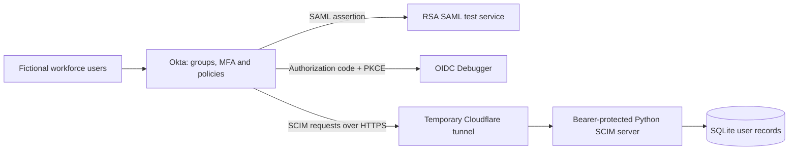
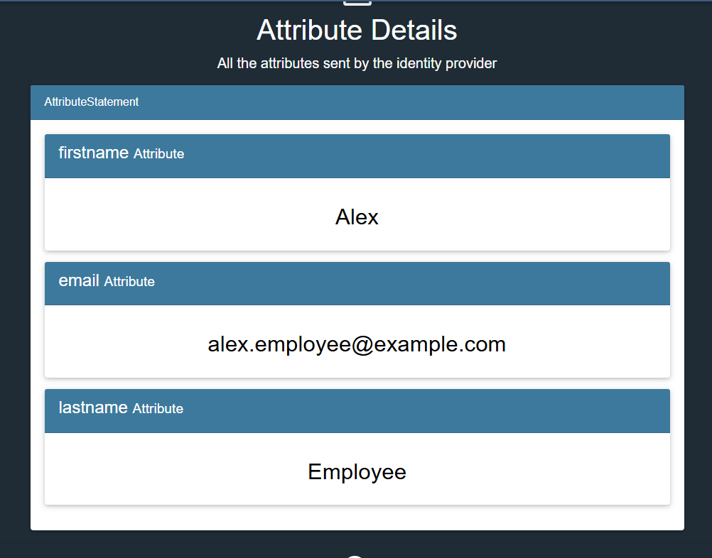
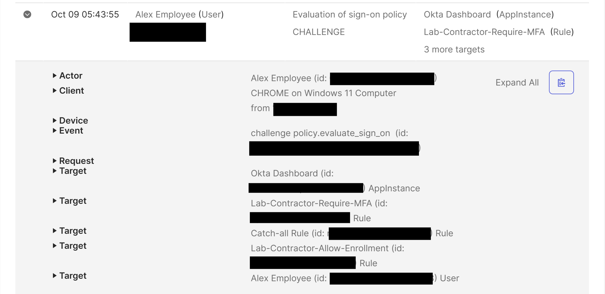
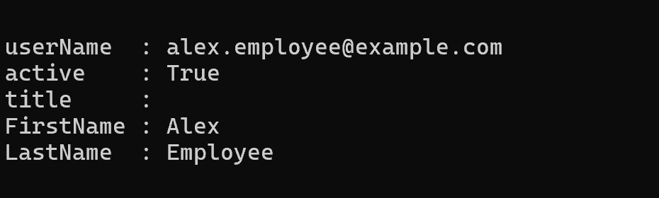
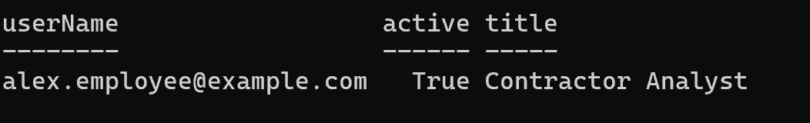
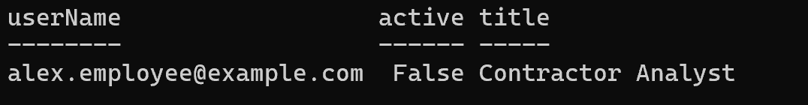

# Okta Workforce Identity Lab

A hands-on identity and access management portfolio project covering MFA, SAML and OIDC federation, manual Joiner/Mover/Leaver workflows, and SCIM account provisioning.

## Business scenario

A fictional company needs workforce identity controls for employees, administrators, and contractors. This lab uses fictional `example.com` identities in an existing Okta Integrator Free Plan tenant. Existing tenant accounts and applications are outside the project scope.

## What I demonstrated

| Phase | Implementation | Validation |
|---|---|---|
| 1. Foundation | Three fictional identities and workforce/application groups | Membership and administrator-role inspection |
| 2. MFA | Password + Okta Verify enrollment; separate contractor session policy | Fresh MFA sign-ins for all three users; Taylor's idle timeout |
| 3. SAML | RSA test service assigned through App-Demo-Users | Alex/Jamie allowed, Taylor denied; identity attributes received |
| 4. OIDC | SPA with Authorization Code + SHA-256 PKCE | Codes exchanged for ID tokens; unassigned Taylor denied |
| 5. Manual JML | Access approval/removal, workforce-role move, account deactivation | Before/after app access; contractor rule selected for Alex; Taylor deactivated |
| 6. SCIM | Python test server and Okta provisioning connector | Downstream create, title update, and active=false deactivation |

## Architecture

Federation proves identity at sign-in. Group assignment determines which users can request application access. SCIM separately manages a downstream user account's lifecycle.

## Selected evidence

### SAML identity attributes

### Contractor policy applied after a workforce move

### SCIM lifecycle
| Created | Updated | Deactivated |
|---|---|---|
|  |  |  |

## Project files

- [Configuration and test results](docs/lab-results.md)
- [Evidence index](evidence/README.md)
- [SCIM server and local setup](scim/README.md)
- [HTTP integration tests](scim/test_server.py)

## Lessons learned

- Authenticator enrollment and sign-in enforcement are distinct controls.
- Policy priority matters when a contractor also joins an application-access group.
- A missing dashboard tile is insufficient denial evidence: test the direct SAML link or a fresh OIDC request.
- System Logs distinguished invalid credentials from application-assignment denial.
- Removing an app assignment and deactivating an Okta identity are separate lifecycle actions.
- Receiving-server state confirmed provisioning changes rather than relying only on the Okta assignment screen.

## Scope and limitations

This is a learning lab, not a production deployment or full SCIM conformance claim. The RSA service displays SAML information; independent production-grade assertion validation was not assessed. ID tokens were issued, but application-side signature/claim validation was not implemented. HR-driven automation, group push, and previously issued token/external-session revocation were not tested. Maximum session lifetimes were configured but not time-tested.

The repository excludes tenant URLs, credentials, databases, raw tokens/assertions, and real employer identity details. Evidence uses fictional identities and supplied redactions. The HTTPS tunnel is temporary and should be stopped after testing.
